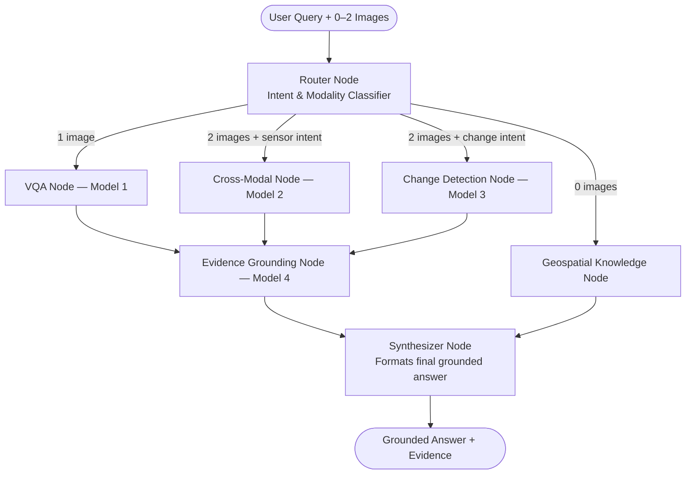

<div align="center">

# 🛰️ SatQuery AI
### An Agentic Vision-Language Assistant for Multimodal Remote Sensing Image Analysis

**Team Spectra** &nbsp;·&nbsp; Smart India Hackathon 2026 &nbsp;·&nbsp; Problem Statement **SIH26167**


*Point at any place on Earth, ask a question in plain English, and get an answer that shows its work — not a guess.*

</div>


---

## 📑 Table of Contents
- [Our Solution](#-our-solution)
- [Key Features](#-key-features)
- [System Architecture](#-system-architecture)
- [How It Works](#-how-it-works)
- [Tech Stack](#-tech-stack)

- [Project Structure](#-project-structure)
- [Getting Started](#-getting-started)
- [API Reference](#-api-reference)
- [Current Limitations](#-current-limitations)
- [Future Enhancements](#-future-enhancements)

- [Acknowledgements](#-acknowledgements)

---


---

## 💡 Our Solution

SatQuery AI answers this with an **agentic, sensor-aware orchestration platform** instead of one generalist model trying to do everything. A LangGraph router reads the query and the attached imagery, decides *which* of three specialist vision-language models is qualified to answer, executes it, and then always routes the result through a fourth **evidence-grounding model** that produces the visual proof behind the answer. All of it sits behind a chat-style workspace with a live, explorable satellite map — so a user can go from *"a place on Earth"* to *"a cited answer"* in one continuous workflow.

| | Generic Multimodal Chatbot | SatQuery AI |
|---|---|---|
| **Optical + SAR** | Treats both as "just images" | Dedicated sensor-aware routing + a purpose-built dual-stream fusion model |
| **Change detection** | Eyeballs two images, states a guess | A fine-tuned temporal-reasoning model **+** a deterministic pixel-diff/Otsu-threshold cross-check |
| **Evidence** | Text only | Attention heatmaps, change masks, bounding boxes, and routing rationale shipped with *every* answer |
| **No GPU available** | Breaks or refuses | Automatic CPU **Mock Demonstration Engine** — the app keeps working |
| **Model selection** | One model, every question | Task-specialized model chosen per query, with a stated confidence score |

---

## ✨ Key Features

- 🌍 **Explore Anywhere** — an interactive Leaflet map (satellite basemap, live lat/lng + resolution telemetry) with location search and one-click region capture, plus curated jump-points (Dubai Palm Jumeirah, Suez Canal, Amazon Rainforest, Himalayan Glaciers, San Francisco Bay, Tokyo Bay).
- 🧠 **Agentic Routing** — a LangGraph router inspects the query text and the number/type of attached images, then dispatches to the correct specialist model with a stated **confidence score and rationale** (e.g. *"Dual imagery with temporal change query → routed to Model 3, 95% confidence"*).
- 🛰️ **4 Purpose-Built AI Nodes** — single-image VQA, optical+SAR cross-modal fusion, bi-temporal change detection, and a model-agnostic evidence-grounding layer.
- 🔍 **Answers That Show Their Work** — every visual answer ships with a ViT attention heatmap, a change mask + bounding boxes, or a sensor-contribution split — never text alone.
- 💬 **Live Explainable Pipeline** — the UI streams the same 5 stages the backend executes (*Understanding query → Selecting model → Analysing imagery → Generating evidence → Preparing response*) over Server-Sent Events, so the user watches the reasoning happen.
- ⚡ **One-Click Demo Scenes** — three pre-generated presets exercise all three specialist models instantly, no imagery hunting required.
- 🔐 **Accounts & Auditable History** — JWT authentication with salted password hashing, and PostgreSQL-backed (SQLite-fallback) persistence of every session, message, and evidence artifact.
- 🖥️ **Never Crashes on Stage** — automatically detects GPU availability; runs the real 4-bit QLoRA models on CUDA, or a physically-grounded Mock/CPU Demonstration Engine when a GPU isn't present.
- 🗺️ **Geospatial-Aware** — a Rasterio-backed ingestion path can read GeoTIFFs and extract CRS, bounds, resolution, and band count from real satellite rasters.

---

## 🏗️ System Architecture


### Agent State Machine (LangGraph)



Routing is **confidence-calibrated**, not a black-box guess:

| Scenario | Decision |
|---|---
| No image attached | `geospatial_qa` (domain knowledge) |
| Exactly 1 image | `vqa` |
| 2 images + change keywords (*"change", "flood", "deforestation"…*) | `change_detect` ]
| 2 images + sensor keywords (*"SAR", "radar", "cloud penetration"…*) | `crossmodal` |
| 2 images, ambiguous query | defaults to `change_detect` |

---

## 🔄 How It Works

1. **Explore the satellite map** — search any location or drop into a preset scene, and capture a snapshot as Image 1 (and Image 2, if comparing two dates or two sensors).
2. **Pick an analysis mode** (or leave it on Smart mode and let the router decide).
3. **Ask your question in plain English** — SatQuery routes it automatically with a stated confidence score and rationale.
4. **Inspect the grounded evidence** — attention heatmaps, change masks, bounding boxes, or sensor-contribution charts, all saved to your session history for later review.

| UI Mode | Internal Model | Inputs Needed |
|---|---|---|
| Smart mode *(recommended)* | Router auto-selects | Query + 0, 1, or 2 images |
| Ask about the image | Model 1 — VQA | 1 image |
| Compare image + radar | Model 2 — Cross-Modal Fusion | 1 optical + 1 SAR image |
| Spot changes over time | Model 3 — Change Detection | Before (T1) + After (T2) images |
| Ask about map details | Geospatial Knowledge Node | Query only — no image |

---

## 🧰 Tech Stack

| Layer | Technology |
|---|---|
| **Frontend** | React 19, Vite, Leaflet.js (world satellite basemap via Esri + CartoDB labels), html2canvas, lucide-react |
| **Backend API** | FastAPI, Uvicorn, Pydantic, Server-Sent Events for live pipeline streaming |
| **Agentic Orchestration** | LangGraph (`StateGraph`, conditional edges), LangChain |
| **Vision-Language Models** | BLIP-2 (`Salesforce/blip2-opt-2.7b`) — ViT-g/14 encoder + Q-Former + OPT-2.7B decoder |
| **Fine-Tuning** | 🤗 PEFT — QLoRA adapters, 4-bit NF4 quantization via BitsAndBytes |
| **Computer Vision** | PyTorch, OpenCV, Matplotlib, Pillow |
| **Geospatial** | Rasterio (GeoTIFF / CRS / band metadata extraction) |
| **Persistence** | SQLAlchemy ORM over PostgreSQL, with automatic SQLite fallback (`satquery.db`) |
| **Auth** | JWT (PyJWT) + salted password hashing |
## 📁 Project Structure

<details>
<summary><b>Click to expand full repository layout</b></summary>

```
Spectra_SIH26167/
├── server.py                     # FastAPI backend — REST + SSE streaming
├── database.py                   # SQLAlchemy models (Postgres → SQLite fallback), JWT auth
├── requirements.txt
├── .env.example
├── run_all.bat / run_backend.bat # One-click Windows launchers
│
├── spectra/                      # AI core
│   ├── satquery_agent.py         # LangGraph orchestrator + all 4 model nodes + evidence engine
│   ├── SatQ_VQA_Model1.ipynb
│   ├── SatQ_CrossModal_Model2.ipynb
│   ├── SatQ_ChangeDetect_Model3.ipynb
│   ├── SatQ_Grounding_Model4.ipynb
│   ├── Model1_VQA/                # model/ · dataset/ · results/ · report/ · config.json
│   ├── Model2_CrossModal/         # checkpoints/ · dataset/ · results/ · config.json
│   ├── Model3_ChangeDetect/       # checkpoints/ · dataset/ · results/ · report/ · config.json
│   └── Model4_Grounding/          # evidence/ · results/ · report/ · config.json
│
├── Implimentation/                # Original design specs (Agent, VQA, fusion, change, grounding)
│
└── frontend/                      # React 19 + Vite workspace
    ├── src/
    │   ├── App.jsx                            # Page routing: Home · How-to-use · About · Command Center
    │   ├── components/
    │   │   ├── Map/SatelliteMapExplorer.jsx    # Leaflet world map, search, snapshot capture
    │   │   ├── Chat/                           # ChatPanel, ProgressStepper, AnswerCard, EvidenceCard
    │   │   ├── Workspace/                      # VisualWorkspace, CompareSlider, ModalityBar
    │   │   ├── Sidebar/                        # AdvancedSettings, PresetScenes, SessionHistory
    │   │   └── Auth/AuthModal.jsx
    │   └── ...
    └── package.json
```

</details>

---

## 🚀 Getting Started

### Prerequisites

- Python 3.10+
- Node.js 18+ and npm

- *(Optional)* PostgreSQL — the app falls back to a local SQLite file automatically if it isn't reachable

### 1. Clone & configure

```bash
git clone <your-repo-url>
cd Spectra_SIH26167
cp .env.example .env   # edit DATABASE_URL / JWT_SECRET if needed
```

### 2. Backend

```bash
pip install -r requirements.txt
python server.py
```
- FastAPI serves on `http://127.0.0.1:8000`
- Auto-detects CUDA; falls back to the Mock/CPU Demonstration Engine if no GPU is found
- Auto-creates `satquery.db` (SQLite) if PostgreSQL isn't configured

### 3. Frontend

```bash
cd frontend
npm install
npm run dev
```
- Vite dev server on `http://localhost:5173`

### One-click (Windows)

`run_all.bat` launches the backend and frontend together; `run_backend.bat` starts the API alone.

## 🔌 API Reference

<details>
<summary><b>Click to expand full endpoint list</b></summary>

| Method | Endpoint | Purpose |
|---|---|---|
| GET | `/api/health` | System status — GPU/CPU mode, loaded checkpoints, active DB dialect |
| POST | `/api/auth/register` | Create an account, returns a JWT |
| POST | `/api/auth/login` | Authenticate, returns a JWT |
| GET | `/api/auth/me` | Current authenticated user's profile |
| GET | `/api/presets` | Pre-generated benchmark scenes for one-click demos |
| GET | `/api/sessions` | List saved analysis sessions |
| POST | `/api/sessions` | Create a new session |
| GET | `/api/sessions/{id}/messages` | Full conversation + evidence history for a session |
| DELETE | `/api/sessions/{id}` | Delete a session and its records |
| POST | `/api/session/new` | Reset/initialize the in-memory working session |
| POST | `/api/chat` | Synchronous analysis — runs the full pipeline, single JSON response |
| POST | `/api/chat/stream` | Same pipeline as Server-Sent Events — live 5-stage progress |

</details>

---

## ⚠️ Current Limitations

We'd rather be upfront about where this stands today than oversell a hackathon build.

**Data & Training**
- **Prototype-scale datasets.** ~200–204 base scenes per model (600+ compositions, 3,020 QA pairs total) prove the architecture but aren't production scale.
- **Synthetic SAR.** SAR imagery for Models 1 & 2 uses a speckle-noise model over optical EuroSAT scenes rather than real Sentinel-1 backscatter, since streaming true co-registered SAR/optical pairs inside a single Colab session wasn't reliable.
- **Synthetic bi-temporal pairs.** Model 3's "after" (T2) scenes are programmatically edited from T1 using six templated change patterns, rather than two genuine acquisition dates of the same location 

**Model & Reasoning**
- **Rule-based router.** `router_node` uses keyword matching (e.g. *"change"*, *"flood"* vs *"SAR"*, *"radar"*) rather than a learned intent classifier, so unusually-phrased queries can be mis-routed.
- **No true multi-turn memory yet.** Session history is captured and threaded through the pipeline call, but the model nodes don't yet consume it — each question is currently answered independently.
- **Attention heatmaps are an activation proxy.** Evidence maps use ViT patch-token L2-norms rather than gradient-based saliency (e.g. Grad-CAM), which is fast and label-free but methodologically simpler.
- **Change area is % of frame, not physical units.** Converting it to km²/hectares needs ground-sample-distance metadata, only available when a real GeoTIFF with CRS is supplied.

**Engineering & Deployment**
- **In-memory active session state.** The working `image1`/`image2` pair lives in a per-process dictionary, so it won't survive a restart or scale across multiple workers — even though chat history and evidence are already durably persisted to the database.
- **CPU inference is a demonstration mode, not a fast production path.** Without CUDA, the app swaps in the Mock/CPU Demonstration Engine (real image analysis, templated language) rather than running the full 2.7B-parameter model.
- **Imagery reaches the backend as rendered PNG/JPEG.** The Rasterio GeoTIFF/CRS path exists in the agent layer, but the frontend doesn't yet expose a native multi-band raster upload.


---

## 🗺️ Future Enhancements

- [ ] Scale training to full EuroSAT + BigEarthNet (real Sentinel-1 SAR & Sentinel-2) and public benchmarks (RSVQA-HR, CDVQA, VRSBench)
- [ ] Replace the keyword router with a learned/LLM-based intent classifier
- [ ] Wire session history into the model prompt for genuine multi-turn follow-ups

- [ ] Gradient-based saliency (Grad-CAM / attention rollout) for more rigorous evidence grounding
- [ ] Native multi-band GeoTIFF upload and band-combination controls in the UI
- [ ] Redis-backed session state for horizontal scaling
- [ ] Model distillation / smaller backbone for real-time CPU inference

- [ ] Formal benchmarking against public RS-VQA / CDVQA leaderboards
- [ ] Dockerized deployment + CI/CD pipeline


---

## 🙏 Acknowledgements

- **[EuroSAT](https://github.com/phelber/EuroSAT)** — Sentinel-2 land-cover dataset used as the base imagery for all three fine-tuning sets
- **[Salesforce BLIP-2](https://huggingface.co/Salesforce/blip2-opt-2.7b)** — base vision-language backbone
- **Hugging Face Transformers & PEFT** — model loading and QLoRA fine-tuning
- **LangGraph / LangChain** — agentic orchestration framework
- **Esri World Imagery & CartoDB** — satellite basemap tiles powering the map explorer
- **ISRO — Space Applications Centre** — for defining Problem Statement 26167
- **Smart India Hackathon 2026** — for the platform to build this

